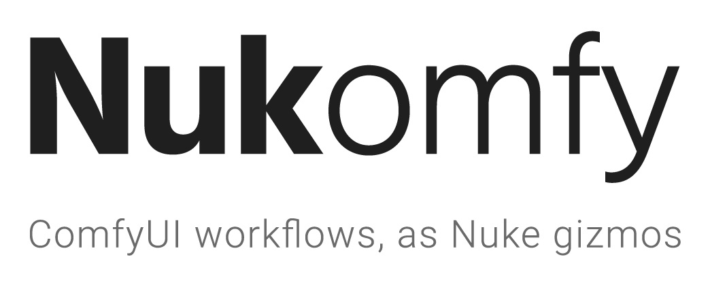
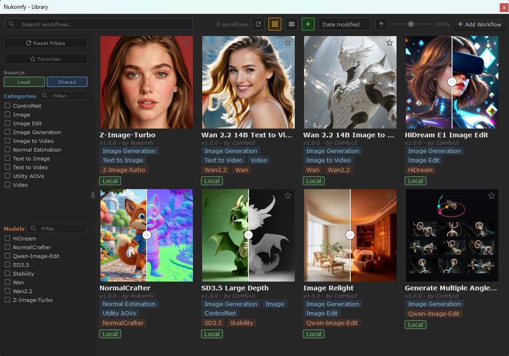
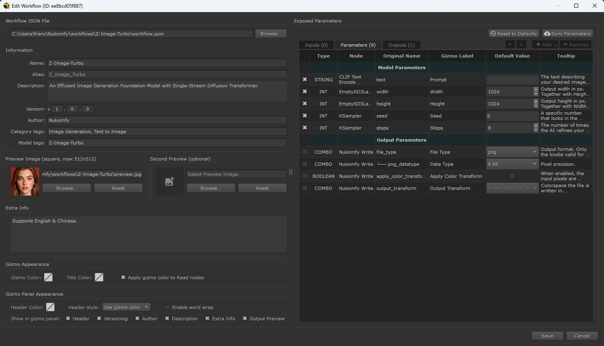
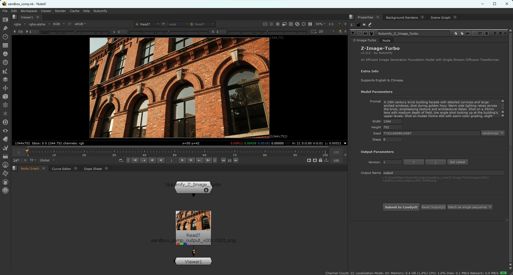
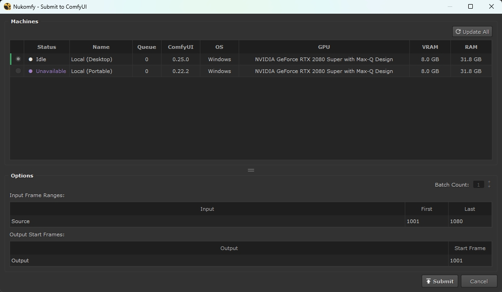
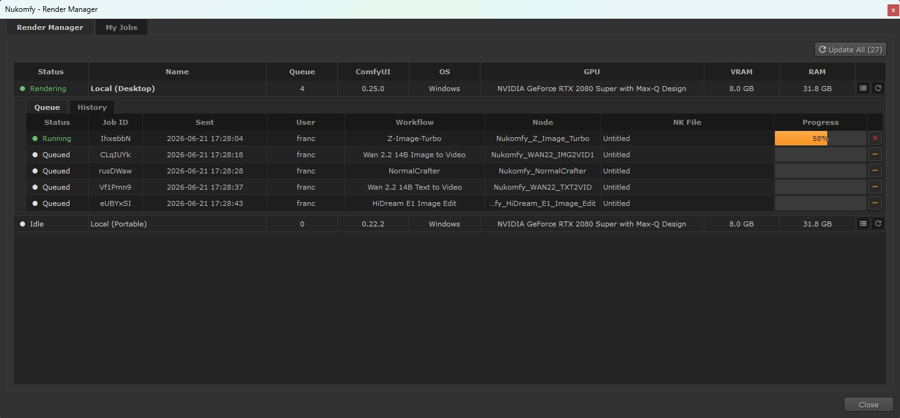
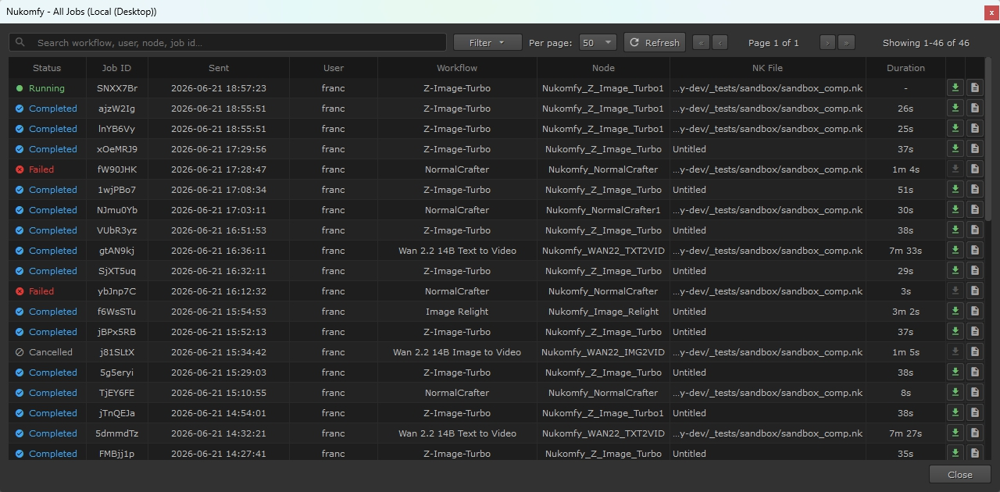

<p align="center"></p>

<p align="center">
  
  
  
</p>

**Nukomfy** is a Python plugin for **Foundry Nuke** that lets you turn **ComfyUI** workflows into reusable Nuke gizmos, send jobs to ComfyUI machines on your network, monitor progress in real time, and import the generated frames straight back into your comp.

TDs set up each gizmo once. Artists tweak only the essential knobs, directly in their comp. No context-switching, no external node graphs to manage.

## Demo

https://github.com/user-attachments/assets/5120bfa3-8b6a-4083-87aa-6c2aa44be6b9

## How it works

1. **Configure a gizmo.** Turn a ComfyUI workflow into a Nuke gizmo. Expose its widgets in ComfyUI's App Builder, choose which ones become knobs in the Workflow Creator, and give the gizmo its own style.
2. **Pick a workflow.** Your Workflow Library holds every workflow you've built, plus any your team shares. Choose one and it becomes a gizmo in your comp.
3. **Submit.** Connect your plates, set the knobs, and send the job to a ComfyUI machine. Nukomfy applies your pre-configured setup, automatically handling file formats and output locations. For single-frame outputs, the batch count lets you submit several variants at once.
4. **Monitor.** The Render Manager shows every job across all your machines, with live progress bars. Cancel or remove your own jobs, or anyone's if you have configured the admin password.
5. **Re-import.** When the render's done, bring the frames back into your comp. Nukomfy keeps a history of every job, with its log, even after ComfyUI restarts, so you can re-import the frames anytime.

## Screenshots

<div align="center">
<table>
  <tr>
    <td align="center" valign="top">
      <a href="docs/images/screenshots/library-panel.jpg"></a>
      <br><sub><b>Workflow Library</b><br>Animated previews, filters, favorites</sub>
    </td>
    <td align="center" valign="top">
      <a href="docs/images/screenshots/workflow-creator.jpg"></a>
      <br><sub><b>Workflow Creator</b><br>Expose workflow widgets as gizmo knobs</sub>
    </td>
    <td align="center" valign="top">
      <a href="docs/images/screenshots/gizmo-in-nuke.jpg"></a>
      <br><sub><b>Gizmo in Nuke</b><br>Gizmo with auto-generated knobs</sub>
    </td>
  </tr>
  <tr>
    <td align="center" valign="top">
      <a href="docs/images/screenshots/submit-panel.jpg"></a>
      <br><sub><b>Submit Panel</b><br>Machine, frame ranges, batch count</sub>
    </td>
    <td align="center" valign="top">
      <a href="docs/images/screenshots/render-manager.jpg"></a>
      <br><sub><b>Render Manager</b><br>Live progress, queue control</sub>
    </td>
    <td align="center" valign="top">
      <a href="docs/images/screenshots/job-history.jpg"></a>
      <br><sub><b>Job History</b><br>Past job records, execution logs</sub>
    </td>
  </tr>
</table>
</div>

## Requirements

- **Nuke** 14.1 or later.
- **ComfyUI** reachable over HTTP (latest stable recommended).
- **[ComfyUI-Nukomfy-Suite](https://github.com/francescolorussi/ComfyUI-Nukomfy-Suite)** installed on every ComfyUI instance. It provides the `NukomfyRead` and `NukomfyWrite` nodes that move frames between Nuke and ComfyUI, and unlocks admin features like reboot, machine availability control, and artists' queue management.
- **Shared folders**: the folders used across machines must be reachable from all of them. If your machines run different operating systems and each reaches those folders through a different path, Nuke's path substitution rules can translate between them.
- **websocket-client** (optional): enables real-time progress bars in the Render Manager. Without it, progress still shows as a hatched bar, updated on each refresh.

**Tested on:** Windows and Linux (macOS not tested yet).

## Installation

1. Download and extract the latest release from the [Releases](https://github.com/francescolorussi/Nukomfy/releases) page.

2. Copy the `Nukomfy` folder into your `~/.nuke/` directory.

3. Add the following line to your `~/.nuke/menu.py`:
   
   ```python
   import Nukomfy
   ```

4. Restart Nuke. The **Nukomfy** menu will appear in the menu bar.

5. On every ComfyUI instance, install [ComfyUI-Nukomfy-Suite](https://github.com/francescolorussi/ComfyUI-Nukomfy-Suite) (see the repo for installation instructions).

### Optional: `websocket-client`

To enable live progress bars, `websocket-client` must be importable from the Python that Nuke runs. It is pure Python and needs Python 3.9 or newer, which every supported Nuke version provides.

#### Option A: install into Nuke's Python (recommended)

Open a terminal (Command Prompt on Windows) and run, replacing `<version>` with your installed Nuke version:

```bash
# Linux / macOS
/usr/local/Nuke<version>/python3 -m pip install websocket-client

# Windows (run the prompt as administrator)
"C:\Program Files\Nuke<version>\python.exe" -m pip install websocket-client
```

#### Option B: bundle the source on Nuke's plugin path

If you cannot write to Nuke's Python, put the package on Nuke's plugin path instead:

1. Download the *Source code (zip)* of the latest [release](https://github.com/websocket-client/websocket-client/releases) (e.g. `v1.9.0`).

2. Extract it and keep the whole `websocket-client-1.9.0/` folder (the importable `websocket/` package is inside).

3. Add that folder to the plugin path from `~/.nuke/init.py`:
   
   ```python
   nuke.pluginAddPath('/path/to/websocket-client-1.9.0')
   ```

## Documentation

For full usage instructions, see the **[User Guide](USER_GUIDE.md)**.

## Current Limitations

Nukomfy officially supports input and output as image sequences only. Other data, such as 3D models, is not officially supported yet, but could be added in the future through a new node in the Suite.

## Bugs & Issues

Nukomfy is in early development and may contain bugs.

Found a bug or have a feature request? [Open an issue](../../issues) on GitHub. Please include the relevant technical details and steps to reproduce.

## Related Projects

Nukomfy isn't the only way to bring ComfyUI into Nuke, here's another great project worth checking out:

- **[vinavfx/ComfyUI-for-Nuke](https://github.com/vinavfx/ComfyUI-for-Nuke)** (GPL-3.0) is an API to use ComfyUI nodes within Nuke, using only the ComfyUI server. Where Nukomfy wraps a finished ComfyUI workflow as a single gizmo, ComfyUI-for-Nuke lets you build workflows inside Nuke itself.

## License

Nukomfy is licensed under the Apache License 2.0. See the [LICENSE](LICENSE) file for the full text.

### Third-party components

| Component                                                                    | License    | How it's used                                                                                                                             |
| ---------------------------------------------------------------------------- | ---------- | ----------------------------------------------------------------------------------------------------------------------------------------- |
| [**Material Design Icons**](https://github.com/google/material-design-icons) | Apache 2.0 | Glyph font (`MaterialIcons-Regular.ttf`) bundled in [Nukomfy/resources/icons/](Nukomfy/resources/icons/), together with its license file. |
