<p align="center">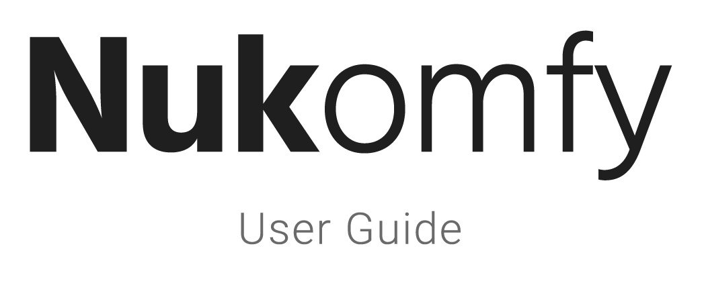</p>

<p align="center"><em>Last updated: 2026-07-11</em></p>

This is a quick reference guide for using Nukomfy: turning a ComfyUI workflow into a Nuke gizmo, submitting renders, and reading frames back into Nuke. It covers basic usage and the non-obvious behaviors. For what Nukomfy is and how to install it, see the [README](https://github.com/francescolorussi/Nukomfy#readme).

This guide assumes you are already familiar with Nuke and ComfyUI, both are installed, and **ComfyUI-Nukomfy-Suite** (the node pack with NukomfyRead and NukomfyWrite) is installed on every ComfyUI instance.

---

# Part 1: Initial setup and adding workflows

## Prerequisites

- **Nuke** 14.1 or later, with Nukomfy enabled (see the README).
- A running **ComfyUI** instance, reachable over HTTP from the Nuke machine.
- **[ComfyUI-Nukomfy-Suite](https://github.com/francescolorussi/ComfyUI-Nukomfy-Suite)** installed on every ComfyUI instance (see the repo for installation).
- **Shared folders** between the workstation and every ComfyUI machine. Any input-cache or output folder must be reachable from all of them. Mount each share at the same path on machines that run the same operating system. If your machines run different operating systems and each reaches those folders through a different path, Nuke's path substitution rules can translate between them (see [Path substitution](#path-substitution)).
- A workflow exported from ComfyUI in **UI format** (File > Export). API format is not supported.

> Every workflow must already run end to end in ComfyUI, with all custom nodes installed and all models downloaded. Nukomfy submits working workflows; it does not install nodes or fetch models for you.

## Add a ComfyUI machine

Machines are the ComfyUI hosts you submit to. Add them in Settings before anything else works.

<p align="center">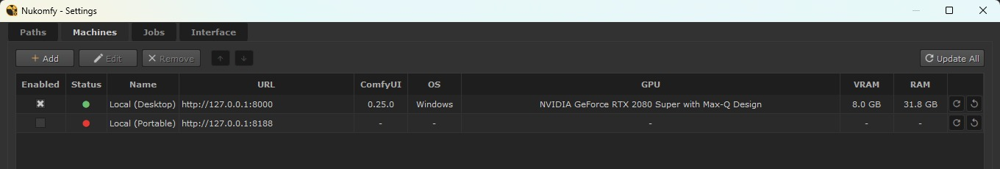 Machines: where you register each ComfyUI host."></p>

1. Open **Nukomfy > Settings > Machines**.
2. Click **Add**. A dialog opens with **Name** and **ComfyUI URL** fields.
3. Enter a **Name** and the **URL** with protocol and port (for example `http://localhost:8188`).
4. Click **Save**. Confirm the machine is reachable: its **Status** dot should turn green.

The table shows each machine's OS, ComfyUI version, GPU, VRAM, and RAM, fetched live.

- **Enabled**: uncheck to keep a machine in the list but out of the Submit panel and Render Manager.
- **Reorder**: use the up/down arrows; the order persists.
- Per-machine **Refresh** re-checks one machine; **Update All** (toolbar) re-checks them all.

> If you can't load the ComfyUI web UI from your workstation in a browser, Nukomfy can't reach it either: check VPN, firewall, and port forwarding.

To add a machine on your local network, first make ComfyUI reachable from other hosts (see [How to access ComfyUI from the local network](https://comfyui-wiki.com/en/faq/how-to-access-comfyui-on-lan)).

A few operations (reboot, aborting or removing another user's job, marking a host Unavailable) require an **admin password** set on the ComfyUI host. See [Admin operations](#admin-operations).

### Hide URL

<p align="center">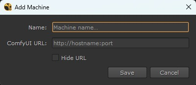</p>

**Hide URL** (in the Add/Edit dialog) shows the URL as `Hidden` everywhere and obfuscates it in config files and the local job database. It keeps URLs out of screenshots and logs; it is **not** authentication. With Hide URL on, the machine **Name** is the only identifier, so names must be unique.

To distribute a hidden URL through overrides, configure the machine locally with Hide URL on, then copy your `~/.nuke/nukomfy_machines.json` into `Nukomfy/settings_overrides/` (see [Settings overrides](#settings-overrides)).

## Paths and output template

The **Paths** tab controls where Nukomfy stores workflows, input frames, and output. Every path field accepts a literal path or a Nuke TCL expression, with a live preview below it.

<p align="center">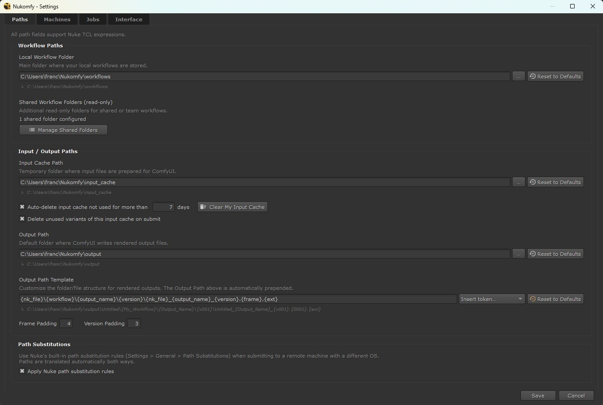 Paths: output path, template, and padding defaults."></p>

### Output Path vs Output Template

These are two separate fields that concatenate at submit as `<Output Path>/<resolved template>`:

- **Output Path** is the static base directory: env vars, project context, anything host- or session-dependent.
- **Output Template** is the per-render structure: pure Python `.format()` with `{token}` placeholders. **No TCL here.** Pick tokens from the **Insert token** dropdown; `{version}`, `{frame}`, and `{ext}` are required; the live preview shows the result (with an error banner if invalid). The field tooltip lists every token, and the Output Path tooltip lists the supported TCL patterns.

Don't repeat the base path in the template.

## What makes a workflow compatible

A workflow must contain at least one **NukomfyWrite** (the output back to Nuke), marked as an app output in ComfyUI. A **NukomfyRead** is needed only when the workflow takes an image or image sequence from Nuke: any node that reads those frames must be a NukomfyRead, but a workflow with no Nuke input (for example text-to-image from a prompt) doesn't need one. Without a NukomfyWrite, the Workflow Creator blocks the import.

<p align="center">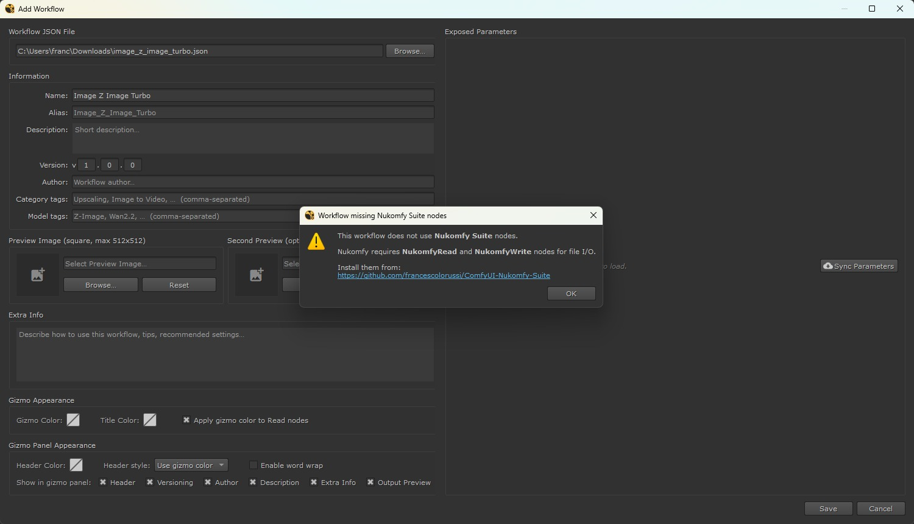</p>

## Prepare the workflow in ComfyUI

Everything here happens in ComfyUI, before you open the Workflow Creator.

1. **Run it once, end to end.** Confirm every custom node is installed and every model is present. If it doesn't run in ComfyUI, it won't run through Nukomfy.
2. **Add the bridge nodes.** Insert at least one **NukomfyWrite** (required), plus a **NukomfyRead** for each image input you take from Nuke (a workflow with no Nuke input doesn't need one). 
3. **Set each widget to the default you want.** The saved values become the default knob values for the widgets you expose, and you can still change them later in the Workflow Creator.
4. **In App Builder, expose every widget you want to become a gizmo knob.** The two Suite nodes are the exception, see below.
5. **In App Builder, mark at least one NukomfyWrite as an output.** Required: a workflow with no marked output is rejected.
6. **Export in UI format: File > Export.** Do not use **Export (API)**: API files are rejected.

<p align="center">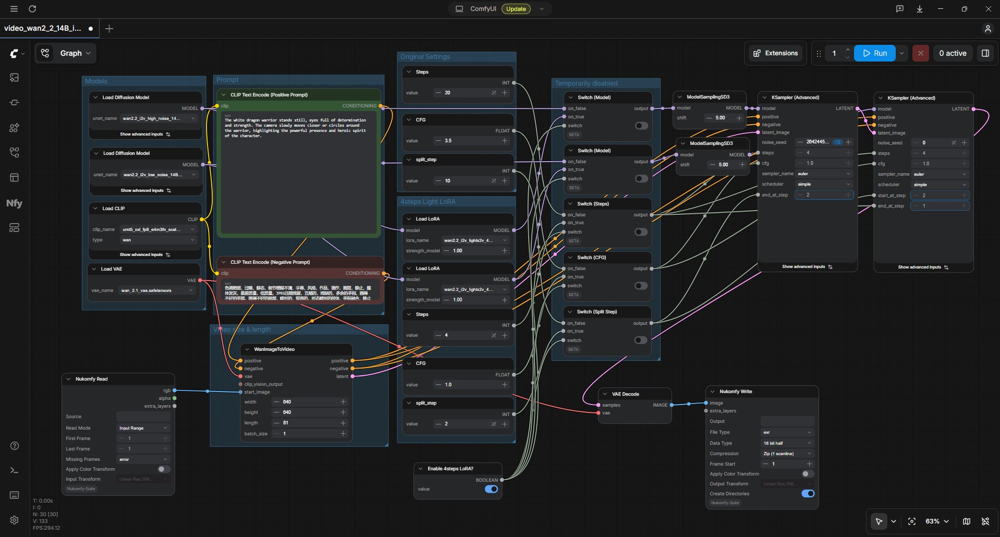</p>

<p align="center">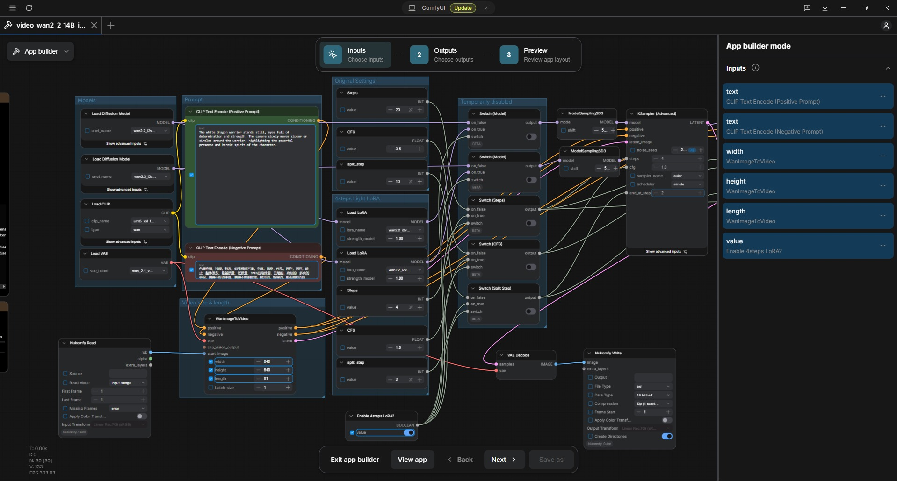</p>

<p align="center">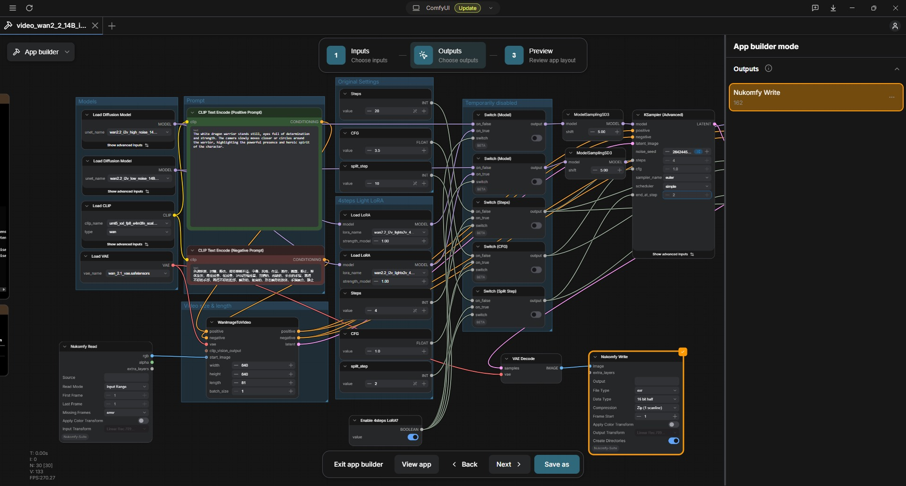</p>

<p align="center">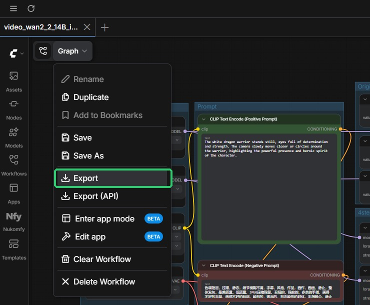 Export); avoid Export (API)."></p>

> **The two Suite nodes are the exception.** For an ordinary node, exposing a widget in App Builder is what turns it into a gizmo knob (step 4). NukomfyRead and NukomfyWrite work differently: the Workflow Creator already lists all of their widgets, so you do not need to expose them. Exposing one only pre-checks it (enabled by default, so it appears on the gizmo), and you can still toggle that in the Workflow Creator. The one App Builder step you must do for these nodes is marking a NukomfyWrite as an output (step 5).

For more on App Builder, see ComfyUI's [App mode guide](https://docs.comfy.org/interface/app-mode).

## Add a workflow (Workflow Creator)

Import a tested workflow and turn it into a gizmo. Open the **Library** (Nukomfy > Library) and click **Add Workflow**.

<p align="center"></p>

1. **Browse** and pick the `.json` exported from ComfyUI. An error appears if the selected file is invalid.
2. Fill in the **metadata** (name, alias, description, version, tags, preview image). Each field is self-explanatory in the form.
3. Click **Sync Parameters**. This needs a reachable ComfyUI instance (it fetches the widget specs from the server), then fills the **Inputs**, **Parameters**, and **Outputs** tabs with one row per exposable parameter.

### Which parameters become knobs

Each row has a checkbox in the first column: tick it to expose that parameter as a knob on the gizmo. Left unticked, the parameter's saved default is still sent to ComfyUI, but the artist can't change it. The Parameters tab lists only the widgets you exposed in App Builder, so expose everything before you Sync. Reorder rows with the arrows; the row order sets the knob order on the gizmo.

Input and output rows also have an **I/O Mode**: `Single` means the workflow expects exactly one frame on that input or output, `Sequence` means one or more (when unsure on an input, choose Sequence). Input rows additionally have a **Write Template**, the on-disk format their frames are cached in before ComfyUI reads them (see [Write templates](#write-templates)).

<p align="center">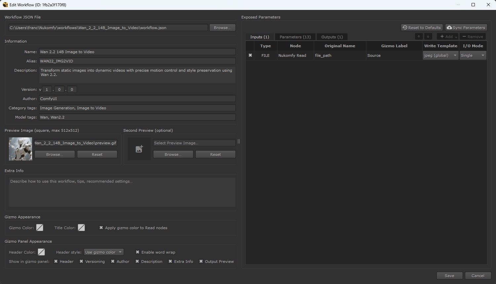</p>

By default the Suite widgets are **unchecked**. The ones you exposed in App Builder are pre-checked. Enable a widget only if you want the artist to control it.

### Auto-managed parameters

A few Suite widgets never appear in Parameters at all. Their value comes from Nukomfy's state at submit, overriding whatever the workflow JSON set:

| Node         | Auto-managed parameters                  | Driven by                      |
| ------------ | ---------------------------------------- | ------------------------------ |
| NukomfyRead  | `read_mode`, `first_frame`, `last_frame` | Submit panel frame range       |
| NukomfyRead  | `file_path`                              | Input cache path               |
| NukomfyWrite | `frame_start`                            | Submit panel start frame       |
| NukomfyWrite | `create_directories`, `file_path`        | Output path from your template |

### Sync Parameters vs Reset Defaults

- **Sync Parameters** re-scans the workflow and pulls the current parameter definitions from the server. Rows you edited keep your choices; rows you never touched refresh; new parameters are placed, removed ones are dropped.
- **Reset Defaults** restores server-fetched fields (Include, Label, Tooltip, Default, row order) to their fresh-from-Sync state. It does **not** touch Write Template or I/O Mode.

### Save

Click **Save**. Nukomfy creates a folder under the Local Workflow Folder containing `workflow.json` (the UI-format workflow), `metadata.json` (name, version, tags, knob config, UUID), the preview image(s), and any workflow-specific write templates. The workflow appears in the Library immediately.

## Write templates

A write template defines how each input's frames are cached before ComfyUI reads them. It is a self-contained Nuke chain with exactly **one `Input`** node and exactly **one `Write`** node, plus any nodes you want in between (LUT, pre-grade, `OCIOFileTransform`). The Write's `file_type` must be a still-image format (`exr`, `tiff`, `png`, `jpg`, `dpx`, `hdr`, etc.); video formats are rejected.

Templates load from two places:

- `Nukomfy/write_templates/`: global, available to all workflows.
- `<Local Workflow Folder>/<workflow_name>/write_templates/`: specific to one workflow (shown with a `(workflow)` suffix).

**Create one:** build the chain in Nuke and save it as a `.nk` file. You can use the bundled `exr.nk`, `jpeg.nk`, and `png.nk` as a starting point.

**Add it to a workflow:** open the **Write Template** combo on any input row and choose **Manage Workflow Templates** to import or remove `.nk` files. These belong to the current workflow only; global templates are never affected.

**Make one global:** copy the `.nk` directly into `Nukomfy/write_templates/`, the folder shared by all workflows. There is no UI for this.

<p align="center">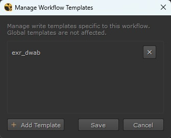</p>

**Hidden behaviors:**

- **The Write is forced into a safe state for caching.** Nukomfy overrides these knobs: **file** (set to the cache path), **create directories** (on), **read file** (off), **limit to range** (off), **disable** (off), and **views** (one view only). Everything else, including every knob on the other nodes, is left exactly as your template sets it.
- **Keep expressions self-contained.** Don't reference the Input or Write node by name, they're renamed when the chain is rebuilt. References between your own chain nodes are fine.

## Colorspace

NukomfyRead and NukomfyWrite handle color with two knobs: a checkbox **Apply Color Transform** (off by default) and a colorspace combo (**Input Transform** on Read, **Output Transform** on Write), populated from the active OCIO config.

- **Off (default):** pixels pass through unchanged; the combo is ignored. Recommended for most AI workflows.
- **On, Read:** the file is converted from its Input Transform to linear Rec.709.
- **On, Write:** the tensor is converted from linear Rec.709 to the Output Transform before writing.

For explicit gamut/curve conversions inside the graph, use the **NukomfyOCIOColorSpace** node.

## Duplicate workflow IDs

<p align="center">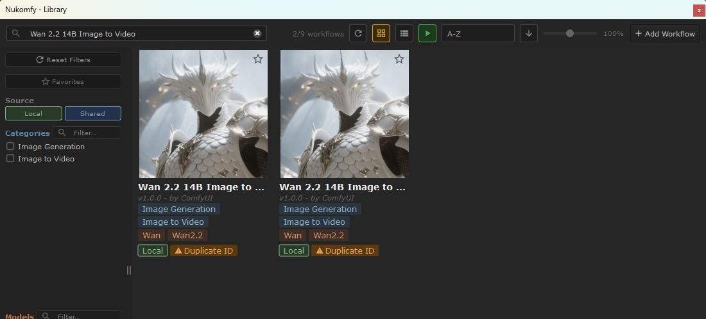</p>

Every workflow gets a UUID in `metadata.json` on first save, so its folder can be renamed or moved without breaking favorites or gizmos. If two workflows share a UUID (usually from copying a folder by hand), the Library shows an orange **Duplicate ID** badge. Open **Edit Workflow** and click **Regenerate ID** to fix it.

## Share workflows with your team

A workflow is a folder, so sharing means making that **folder** reachable; the gizmo is rebuilt from it on each machine, there's no node to copy.

<p align="center">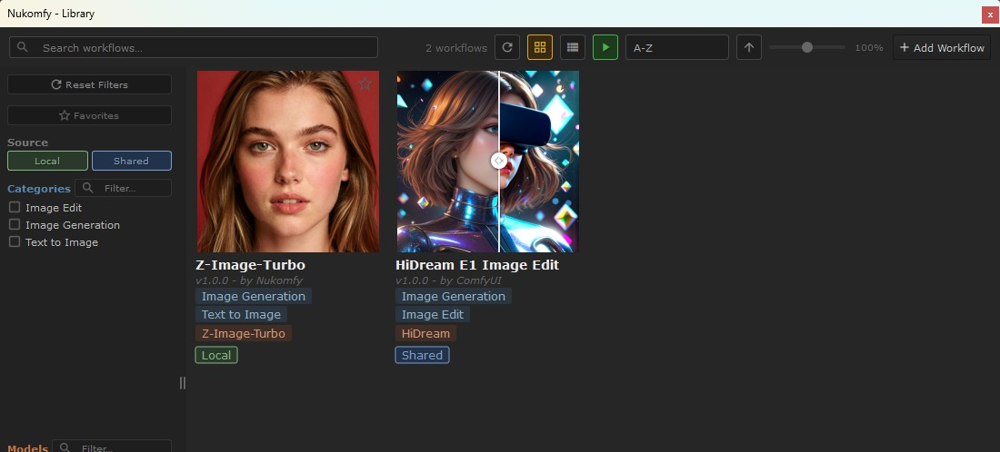</p>

1. Add the workflow as usual (saved to your Local Workflow Folder).
2. Copy its folder into a **Shared Workflow Folder** (a network path the team can read).
3. Each teammate adds that path under **Settings > Paths > Shared Workflow Folders**. It then appears in their Library under the **Shared** source filter.

> - **Shared folders are read-only to the Library.** To change a shared workflow, copy it back to your Local Workflow Folder, edit it, and re-share.
> - **Share the folder, not the gizmo node.** A gizmo pasted without its folder on disk won't work.
> - **Keep UUIDs unique.** Re-share the same folder rather than copy-and-rename (that causes a Duplicate ID collision).
> - **Admins** can push and lock a fixed set of shared folders (see [Settings overrides](#settings-overrides)).

---

# Part 2: Submitting and managing renders

## Library

The entry point for browsing workflows and creating gizmos. Open it from **Nukomfy > Library**.

<p align="center"></p>

Grid/list views, live search, source and tag filters, favorites (stored by UUID), sort, and a zoom slider are all in the toolbar and sidebar. **Double-click** a card to create a gizmo in the current Nuke script; **right-click** for **Import as Gizmo**, **Edit Workflow** (Local only), and **Show in Explorer**. Choose which card fields appear in **Settings > Interface > Library Card Fields**.

## The gizmo

<p align="center">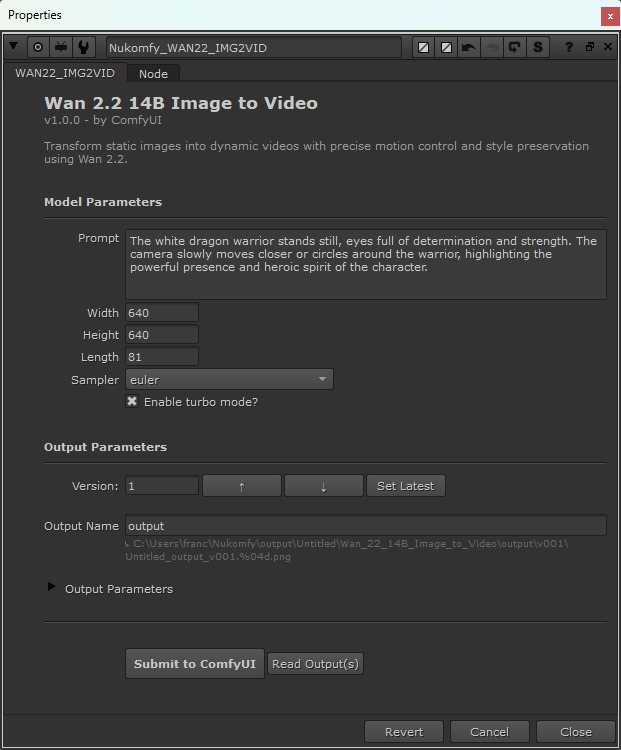</p>

A gizmo is a regular `Group` node, named `Nukomfy_<workflow>` by default. The **Alias** field in the Workflow Creator controls the node name (and the `{workflow_alias}` token); empty = the workflow name. To drop the `Nukomfy_` prefix on new gizmos, turn off **Settings > Interface > Gizmo > Add Nukomfy prefix to gizmo name**.

The properties panel shows the header, the Included knobs in the order set in the Workflow Creator, the per-output section with a live **Output Path Preview**, a version row (drives `{version}`), and two action buttons: **Submit to ComfyUI** and **Read Output(s)** (see [Reading results](#reading-results)).

When every output is in **Single** mode (so a batch count above 1 is possible), a dropdown next to **Read Output(s)** sets how batch results are imported: **Batch as single sequence** (default, all frames in one Read node) or **Batch as separate Reads** (one Read node per file).

## Submit a job

Click **Submit to ComfyUI** in the gizmo panel.

<p align="center"></p>

- **Machines list.** 1 s after opening, the first idle (or first reachable) machine is auto-selected; click any row to lock the selection. Offline machines sort to the bottom but stay visible; to hide one, uncheck its Enabled box in Settings.
- **Input frame ranges.** If any input is in range mode, a First/Last table appears.
- **Output start frames.** Sets the first frame number written to disk; use it to offset sequences. Auto-tracks the input range until you edit it.
- **Batch count.** When N > 1, the submit is sent as N jobs writing consecutive frame numbers (1, 2, 3, ...) in the same version, not multiple versions. With `randomize` seed mode, each frame is a different variant.

### Pre-flight checks

Before posting, the Submit panel runs four checks:

<p align="center">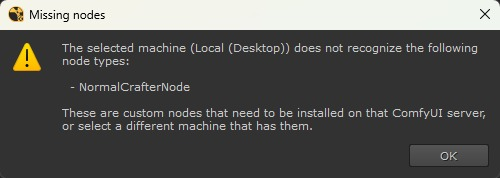</p>

1. **Machine health**: an offline machine aborts the submit with a dialog.
2. **Workflow nodes**: every node must exist on the target machine; missing ones are listed by type.
3. **Input cache concurrency**: if another of your jobs uses an overlapping cache, you're warned and can cancel it first.
4. **Output dir concurrency**: if another job is writing the same output directory, you're warned to bump the version or output name.

## Render Manager

The live view of your machines: per-machine queues, history, and progress. Open from **Nukomfy > Render Manager**.

<p align="center"></p>

A machine **Name** is **bold** when you have jobs on it. Click a row to expand its sub-tables (only one expands at a time). **Update All** shows a countdown to the next auto-refresh (interval in **Settings > Jobs**, default 30 s); per-machine **Refresh** updates just that machine.

### Queue sub-table

- **Running** jobs at the top with a live progress bar: smooth if you have `websocket-client` installed, or a hatched bar that updates on each refresh if you don't. The bar's tooltip shows which node ComfyUI is running and the step it's on. The percentage comes from the server, so it's correct on open, after a restart, or as a second viewer.
- **Queued** jobs below. **Abort** (red) interrupts a running job; **Remove** (orange) drops a pending one. The row greys to `Aborting…`/`Removing…` immediately.
- Removing a pending job just deletes the local entry, with no record left behind. Aborting a running job stops it on the server and leaves a **Cancelled** record in History, which persists across a restart.
- **External jobs** (from the ComfyUI UI or other clients) show with an `External` Job ID and greyed Abort/Remove; they count toward machine load but are managed from ComfyUI.
- **Cross-user** abort/remove routes through the admin password prompt (see [Admin operations](#admin-operations)).
- **Double-click** any row to open the Job dialog.

### History sub-table

Server-backed: recent terminated Nukomfy jobs from **all users** on that machine. Jobs submitted outside Nukomfy are filtered out. Right-click a row for **Show Job Detail**, **Copy Job ID**, and **Show Output(s) Folder**.

### Job dialog

<p align="center">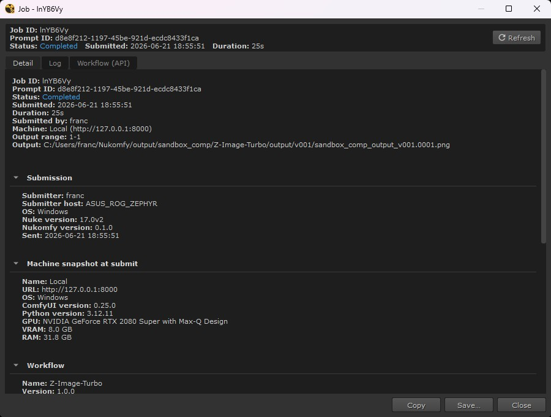</p>

<p align="center">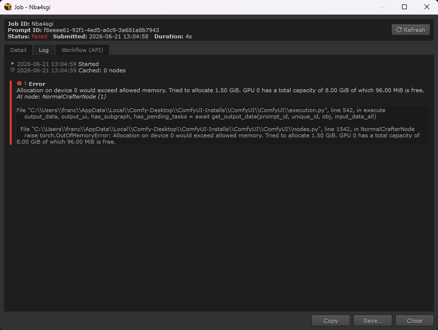</p>

Three tabs: **Detail** (submission and execution metadata, I/O paths, seeds), **Log** (chronological server events including the full traceback on error), and **Workflow (API)** (the API-format workflow actually submitted).

## My Jobs

Your own jobs across all machines, filtered to your username. Open from **Nukomfy > Render Manager > My Jobs**.

<p align="center">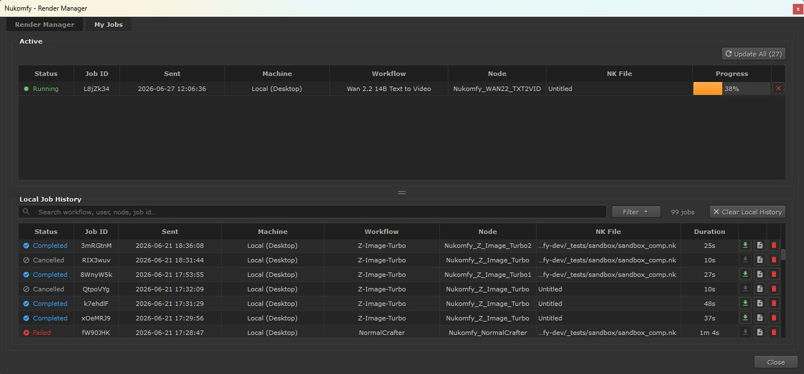</p>

- **Active**: your running/queued jobs, with live progress and the same Abort/Remove buttons. `? Unknown` means the status couldn't be read yet because the machine is unreachable or hasn't been fetched; it clears on the next successful fetch.
- **History**: your terminated jobs, kept in a local database (`nukomfy_history.db`), so they stay available even after the server no longer has a record of them. Each row has a **Read Outputs** icon (green when frames exist) and a **Delete**. **Clear History** empties local history (active jobs unaffected).

## Reading results

Two ways to bring rendered frames back. They differ in **which path they resolve**, which is the non-obvious part.

<p align="center"></p>

- **From the gizmo** (`Read Output(s)` button): scans disk at the path resolved from the gizmo's **current** state (current version, output name, template). One Read node per output, frame range auto-detected.
- **From My Jobs** (green **Read Outputs** icon on a History row): uses the path **registered at submit time**, not the gizmo's current state, and places the Read nodes in the node graph.

> **Changing the Output Path or Template after a submit breaks the gizmo's Read Output(s)** for older jobs (the gizmo always resolves from current settings). **My Jobs > History** preserves the submit-time path, so use it to recover frames from old renders.

## Input cache

To send frames to ComfyUI, Nukomfy renders the nodes upstream of each input to a temporary folder (the **input cache**), which NukomfyRead then reads from, so the same nodes aren't re-rendered every iteration.

<p align="center">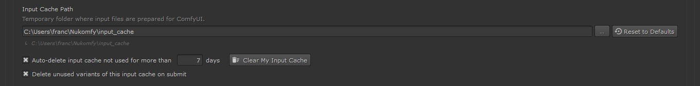</p>

### Path layout

```
{Input Cache Path}/{user}/{nk_file}/{gizmo}/{input}/{fingerprint}/
```

`{user}` is your OS username (each user gets a separate branch, so a shared base path stays isolated per user), `{nk_file}` the script name without version, `{gizmo}` the node name, `{input}` the slot name, and the final level a fingerprint of the upstream chain.

### When the cache is reused

Each cache dir is keyed by Nuke's native upstream hash (the value you see when you press **I** on a node) and tracks per-frame `mtime` and `size`. At submit:

| Situation                               | Result                                     |
| --------------------------------------- | ------------------------------------------ |
| Same knobs, same range, same timestamps | Cache reused, no render.                   |
| Same knobs, larger range                | Only new frames rendered; existing reused. |
| Same knobs, smaller range               | Cache reused.                              |
| Same knobs, source overwritten upstream | Only changed frames re-rendered.           |
| Any upstream knob change                | New fingerprint, new cache dir.            |

### Input cache cleanup

- **On submit (default on)**: each submit removes your old fingerprint variants not in use by a running render. Toggle in **Settings > Paths**.
- **TTL purge at boot**: Nuke startup deletes cache dirs older than **Input Cache Max Age** (days). `0` disables it.
- **Clear My Input Cache** (Settings > Paths): confirms total size, then removes everything under your user branch. Other users' caches are never touched.

Each cache dir carries a `.nukomfy_input_cache.json` sentinel and is deleted only after several safety checks; a folder without a valid sentinel, and any unrelated file you drop into a cache leaf, is never touched.

## Path substitution

When machines run different operating systems and reach the same volume through different paths (e.g. `Z:\projects` on Windows, `/mnt/projects` on Linux), Nukomfy can translate paths to and from ComfyUI.

<p align="center">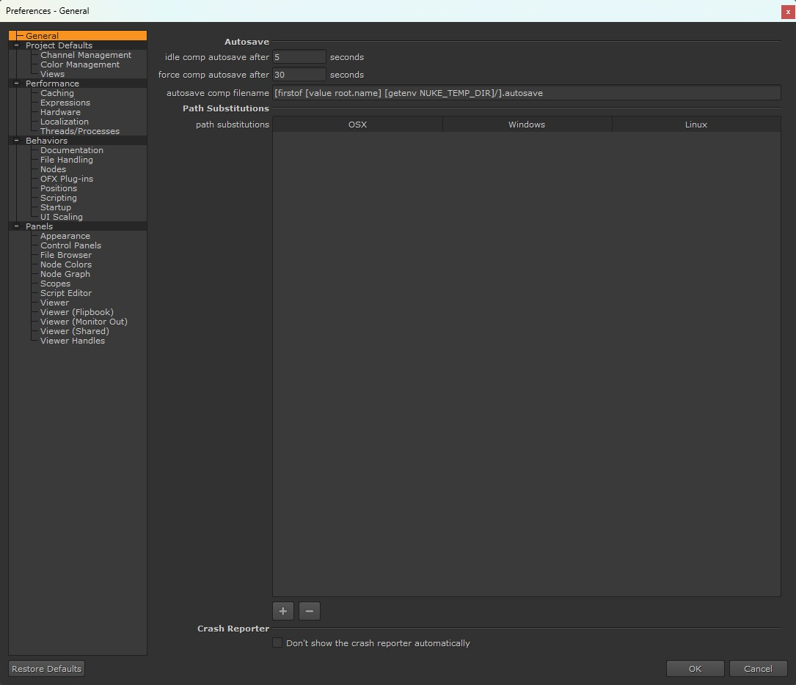 General)."></p>

**Setup:** configure the rules in **Nuke > Preferences > General > Path Substitutions** (Nukomfy reuses Nuke's own rules), then enable **Apply Nuke path substitution rules** in **Settings > Paths**.

**Scope (the non-obvious part):** substitution applies **only at the ComfyUI boundary** (input cache, output), not to how the Settings paths resolve on your own workstation. To keep those portable across multiple OSes, write them as TCL environment-variable paths (e.g. `[getenv NKMF_LIB]/workflows`) rather than literal per-OS drive paths.

## Admin operations

A few operations affect other users or the machine itself, so they're gated behind a per-machine **admin password** set on the ComfyUI host.

<p align="center">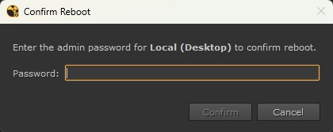</p>

### What needs admin auth

1. **Force abort/remove of another user's job** (Render Manager).
2. **Rebooting a machine** (Settings > Machines > Reboot).
3. **Marking a machine Unavailable** (from the Manager sidebar in the browser).

Before running one of these, Nukomfy checks the machine. If it's offline, the manager isn't installed, or no admin password is set, it reports the reason; otherwise it prompts for the password. Each machine has its own password.

### Mark a machine Unavailable

The workstation owner can mark a machine **Unavailable** to signal "I'm using this, don't submit here." Toggle it from the **Manager sidebar** in the browser running ComfyUI (confirm with the admin password). While Unavailable, the status shows in amethyst and new submissions are **blocked**; running/queued jobs keep going. It's a coordination signal, not a security lock.

### Forgotten admin password

Delete the hash file on the host, then reload the Manager sidebar (no restart needed):

```
<ComfyUI install>/user/default/nukomfy_manager/auth.json
```

## Settings overrides

In a multi-artist install, an admin can push read-only settings to everyone: drop centrally managed JSON into a dedicated folder and the values replace each artist's (and lock them in the UI). The mechanism is not exposed in the UI, this is the only place it's documented.

<p align="center">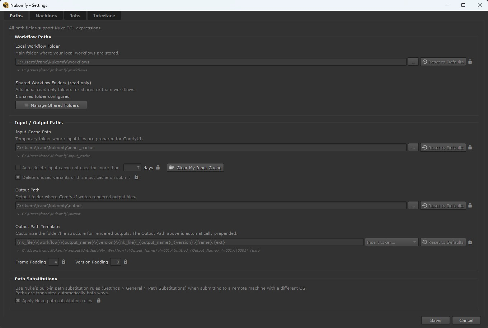</p>

### Where it lives

```
<plugin install root>/Nukomfy/settings_overrides/
```

The folder ships empty; populating it is opt-in. It's read once when Nuke starts, so to push a change edit the JSON and ask artists to restart.

### Recognized files

| File                    | Override scope                                                    |
| ----------------------- | ----------------------------------------------------------------- |
| `nukomfy_settings.json` | Plugin-wide settings (paths, toggles, intervals, output template) |
| `nukomfy_machines.json` | The machine list in Settings > Machines                           |

Schemas match the user files in `~/.nuke/`: copy your own as a template, then trim to the keys you want to impose. **Only the keys present** become locked; everything else stays under artist control. Overridden fields appear greyed with a lock icon. Malformed JSON and unknown keys are ignored.

For example, to impose just the output path and refresh interval:

```json
{
  "default_output_path": "//fileserver/team/comfy_renders",
  "auto_refresh_interval": 60
}
```

### Hidden flags: restricting workflows and machines

Three keys have no UI control and are read from `nukomfy_settings.json` only. All default to `false`:

| Key                       | Effect when `true`                                                                                                                            |
| ------------------------- | --------------------------------------------------------------------------------------------------------------------------------------------- |
| `disable_local_workflows` | Local library off everywhere: the Library reads shared roots only, the Source filter disappears, Add Workflow is hidden.                      |
| `lock_shared_folders`     | Artists can't add/edit/remove shared folders; paths come only from the override.                                                              |
| `lock_machines`           | Artists can't add/edit/remove/reorder machines; the list comes only from the override. Enabled, Refresh, Update All, and Reboot keep working. |

Combine them to lock the library to one admin-managed folder:

```json
{
  "shared_workflow_paths": ["//fileserver/team/workflows"],
  "disable_local_workflows": true,
  "lock_shared_folders": true
}
```

### Notes

- **Multi-OS:** path values are applied as-is on each client. Write any path that must resolve on more than one OS as a TCL env-var expression (`"local_workflow_path": "[getenv NKMF_LIB]/workflows"`) and define the variable per OS. UNC paths work everywhere they're reachable.
- For `nukomfy_machines.json`, generate the `id` UUIDs once and reuse them across pushes: Nukomfy matches global entries by `id`, so stable IDs let you rename a machine without losing its identity. A user machine whose `id` collides with a global one is dropped.
- Three local files are never overridable (per-workstation state): `nukomfy_uistate.json`, `nukomfy_favorites.json`, `nukomfy_history.db`. **Reset UI to Defaults** never touches `settings_overrides/`.

---

# Reference

## Status reference

### Machine status

Shown as `● Label` with a color dot.

| Status      | Meaning                                                                                 |
| ----------- | --------------------------------------------------------------------------------------- |
| Idle        | Reachable, no running or pending jobs.                                                  |
| Rendering   | Reachable, at least one job running.                                                    |
| Queued      | Reachable, jobs pending but none running.                                               |
| Offline     | Not reachable. Sorted to the bottom; uncheck Enabled to hide it.                  |
| Unavailable | Marked unavailable. Blocks new submissions; running and queued jobs continue. |

### Job status

| Status    | Meaning                                                                                                                |
| --------- | ---------------------------------------------------------------------------------------------------------------------- |
| Queued    | Accepted, waiting to execute.                                                                                          |
| Running   | Executing on the machine. |
| Completed | Finished successfully.                                                                                                 |
| Failed    | Ended with an error, or the job was lost (the server crashed, restarted, or dropped it from the queue without reporting a result). |
| Cancelled | Aborted while running. (Removed pending jobs are deleted, not Cancelled.)                                              |
| Unknown   | Transient: machine offline or not yet fetched. Shown as `? Unknown`.                                                   |

## Troubleshooting

**A machine shows Offline.** Nukomfy can't reach the host over HTTP. Open the URL in a browser; if it doesn't load, check VPN, firewall, and port forwarding. If it loads but Nukomfy still shows Offline, click **Refresh** to re-probe the machine.

**Submit fails with "Missing nodes".** A node the workflow uses isn't installed on the target machine. Install the listed node on the server and restart ComfyUI.

**Submit blocked: no NukomfyRead/NukomfyWrite.** Install ComfyUI-Nukomfy-Suite on the server, add a NukomfyRead and a NukomfyWrite in ComfyUI, re-export the UI-format JSON, and add it again.

**Frames not found after a template change.** You changed the Output Path/Template after submitting. Use **My Jobs > History > Read Outputs** for that job: it remembers the submit-time path.

**Input cache folder too large.** Unused fingerprint variants have accumulated. Run **Clear My Input Cache**, or raise Input Cache Max Age.

**Completed, but Read Outputs finds zero frames.** The directory exists but has no matching frames. Check the Log tab, confirm version and output name, and recover from **My Jobs > History** if a later submit overwrote the folder.

**Forgotten admin password locks Reboot and cross-user actions.** Delete `<ComfyUI install>/user/default/nukomfy_manager/auth.json` on the host, then reload the Manager sidebar.
